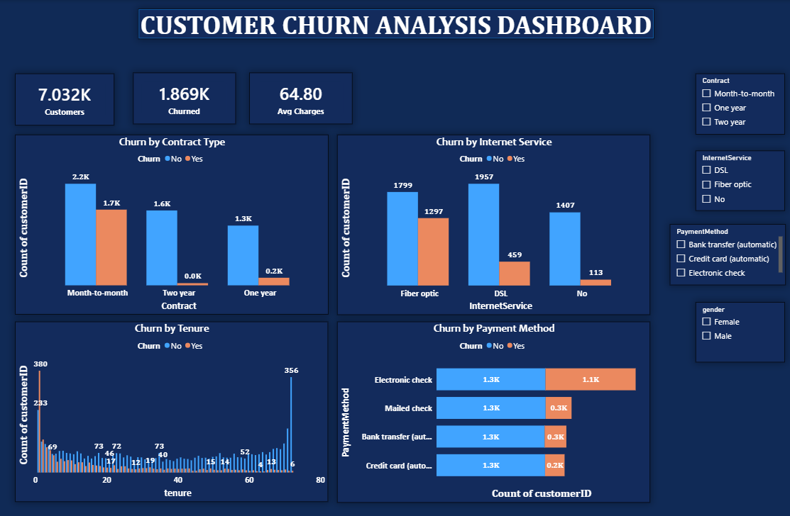

# 📊 Customer Churn Analysis Dashboard

An interactive **Power BI dashboard** designed to analyze customer churn, identify key factors influencing customer retention, and provide actionable business insights through dynamic visualizations and KPIs.

---

## 📌 Project Overview

Customer churn is a major challenge for subscription-based businesses. This dashboard analyzes customer demographics, contract details, internet services, payment methods, and tenure to uncover churn patterns and support data-driven decision-making.

The dashboard enables users to explore customer behavior through interactive filters and visualizations.

---

## 🎯 Objectives

- Analyze customer churn trends.
- Identify high-risk customer segments.
- Compare churn across contract types, internet services, and payment methods.
- Build an interactive dashboard for business stakeholders.
- Present key performance indicators (KPIs) for quick decision-making.

---

## 🛠️ Tools & Technologies

- Microsoft Power BI
- Power Query
- DAX (Data Analysis Expressions)
- Data Modeling
- Interactive Slicers

---

## 📂 Dataset

The dataset contains customer information including:

- Customer ID
- Gender
- Senior Citizen
- Partner
- Dependents
- Tenure
- Contract Type
- Internet Service
- Payment Method
- Monthly Charges
- Total Charges
- Churn Status

---

## 📈 Dashboard Features

### KPI Cards
- 👥 Total Customers
- ⚠️ Churned Customers
- 💰 Average Monthly Charges

### Interactive Visualizations
- Churn by Contract Type
- Churn by Internet Service
- Churn by Payment Method
- Churn by Customer Tenure

### Filters (Slicers)
- Contract
- Internet Service
- Payment Method
- Gender

---

## 📊 Key Business Insights

- Customers with **Month-to-Month contracts** have the highest churn rate.
- **Fiber Optic** users are more likely to churn compared to DSL customers.
- Customers paying through **Electronic Check** exhibit the highest churn.
- Customers with **shorter tenure** are more likely to leave.
- Long-term contract customers demonstrate significantly better retention.

---

## 📷 Dashboard Preview

> Add your dashboard screenshot here.

```markdown

```

---

## 🚀 Skills Demonstrated

- Data Cleaning
- Data Transformation
- Power Query
- DAX
- KPI Design
- Dashboard Development
- Interactive Reporting
- Business Intelligence
- Data Visualization
- Business Insights

---

## 📁 Project Structure

```
Customer-Churn-Analysis/
│
├── Dataset/
│   └── customer_churn.csv
│
├── SQL_Queries/
│   ├── create_table.sql
│   ├── eda_queries.sql
│   └── advanced_sql_queries.sql
│
├── PowerBI/
│   └── Customer_Churn_Dashboard.pbix
│
├── Dashboard.png
├── README.md
```

---

## 🎯 Business Value

This dashboard enables businesses to:

- Identify customer segments with high churn risk.
- Improve customer retention strategies.
- Monitor churn trends using interactive visualizations.
- Support data-driven decision-making.

---

## 📌 Conclusion

This project demonstrates the complete analytics workflow, from SQL-based data exploration to building an interactive Power BI dashboard. It showcases practical skills in data cleaning, visualization, dashboard design, and business analysis.

---

## 👨‍💻 Author

**Your Name**

- GitHub: https://github.com/yourusername
- LinkedIn: https://linkedin.com/in/yourprofile
